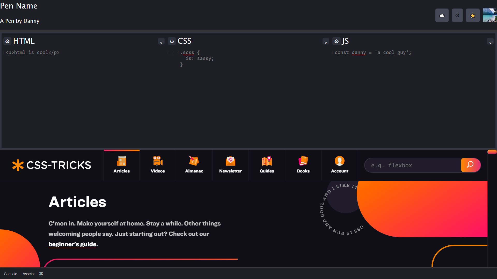

# Exercises from the [Wes Bos CSS-Grid Playlist](https://www.youtube.com/playlist?list=PLu8EoSxDXHP5CIFvt9-ze3IngcdAc2xKG)

## Album Layout

- A gallery of music albums using nested grids

## Codepen Clone

- A clone of Codepen
- Contains an iFrame of popular website [CSS-TRICKS](https://css-tricks.com/)

# Reponsive Website

- A responsive taco website using @media queries

